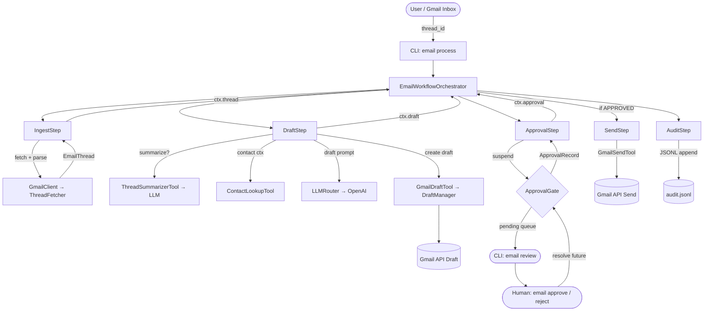
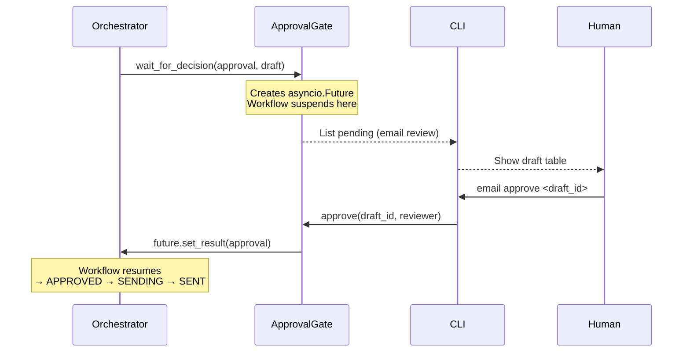
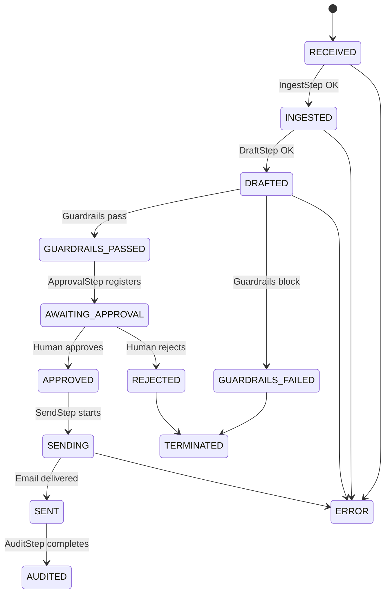
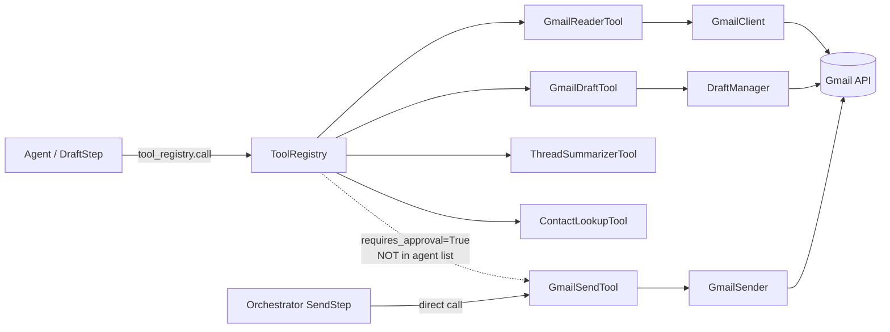
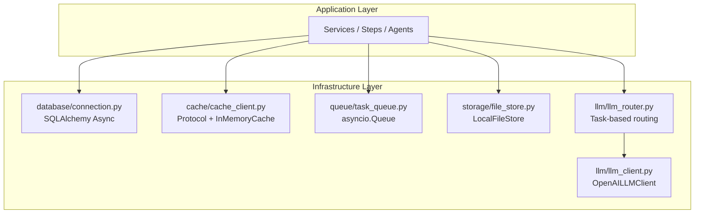

# Architecture: AI Email Assistant Harness

> **Branch:** `BANG-tools`  
> **Version:** 1.0.0

---

## 1. Overview

The AI Email Assistant Harness is an agentic system that reads Gmail threads, drafts intelligent replies using an LLM, enforces a mandatory **human approval gate** before sending, and logs every action immutably. It demonstrates Harness Engineering patterns: workflow orchestration, HITL approval, permission-safe tool access, guardrails, and audit logging.

---

## 2. System Data Flow



---

## 3. Approval Flow Detail



---

## 4. State Machine



---

## 5. Tool Layer Architecture



---

## 6. Infrastructure Layer



---

## 7. Folder Structure & Responsibilities

```
src/
├── cli/                        Entry point. Typer CLI with Rich TUI.
│   ├── app.py                  All CLI commands (email process/review/approve/reject/audit).
│   ├── runner.py               Async workflow runner with Rich Live progress display.
│   ├── display.py              All Rich TUI widgets (unchanged from original).
│   ├── themes.py               Color palette and panel styles (unchanged).
│   ├── flow_viewer.py          Debug flow viewer (unchanged).
│   └── commands/               Future sub-command modules.
│
├── config/                     Configuration ring (innermost infrastructure).
│   ├── settings.py             pydantic-settings: env-driven, fail-fast validation.
│   ├── constants.py            All enums: WorkflowStatus, ApprovalDecision, AuditAction.
│   └── logging_config.py       Structured JSON / text logging setup.
│
├── models/                     Domain entities (Ring 1 — no infrastructure imports).
│   ├── email.py                EmailMessage, EmailThread dataclasses.
│   ├── draft.py                Draft dataclass.
│   ├── approval_record.py      ApprovalRecord dataclass.
│   └── audit_event.py          AuditEvent dataclass.
│
├── integrations/gmail/         Gmail API adapter (Ring 3 — Interface Adapter).
│   ├── auth.py                 OAuth2 credential loading: env → file → interactive.
│   ├── client.py               GmailClient: builds service, mock fallback.
│   ├── message_parser.py       Parse raw Gmail JSON → EmailMessage domain model.
│   ├── thread_fetcher.py       Fetch + parse full threads.
│   ├── draft_manager.py        Create Gmail drafts (MIME encoding).
│   └── sender.py               Send approved drafts.
│
├── tools/                      Tool Layer (Ring 3 — Interface Adapter).
│   ├── base_tool.py            Abstract BaseTool: schema validation, LLM dict export.
│   ├── registry.py             Central registry: register, get, call, agent filtering.
│   ├── gmail_reader_tool.py    Read Gmail threads for agent context.
│   ├── gmail_draft_tool.py     Create Gmail drafts (agent-callable).
│   ├── gmail_send_tool.py      Send drafts — requires_approval=True (orchestrator only).
│   ├── thread_summarizer_tool.py  LLM thread summarisation (context compression).
│   └── contact_lookup_tool.py  CRM contact lookup (mock → real CRM).
│
├── workflow/                   Application / Use Cases (Ring 2).
│   ├── engine/
│   │   ├── state_machine.py    Enum transition table; WorkflowTransitionError.
│   │   └── orchestrator.py     Thin pipeline coordinator calling steps in sequence.
│   └── steps/
│       ├── ingest_step.py      Fetch + parse Gmail thread.
│       ├── draft_step.py       LLM drafting with tool use.
│       ├── approval_step.py    Register with ApprovalGate and suspend.
│       ├── send_step.py        Call GmailSendTool post-approval.
│       └── audit_step.py       Write workflow outcome to audit log.
│
├── approval/                   Approval Gate (Ring 2 — Application).
│   └── gate.py                 asyncio.Future-based HITL gate; approve()/reject() API.
│
├── audit/                      Audit system (Ring 2 — Application).
│   ├── logger.py               Append-only JSONL audit logger with async lock.
│   └── event.py                Re-export AuditEvent from models.
│
└── infrastructure/             Ring 4 — External services, no business logic.
    ├── database/connection.py  SQLAlchemy async engine + session context manager.
    ├── cache/cache_client.py   CacheClient Protocol + InMemoryCache.
    ├── storage/file_store.py   StorageClient Protocol + LocalFileStore.
    ├── queue/task_queue.py     asyncio.Queue background task dispatcher.
    └── llm/
        ├── llm_client.py       LLMClient abstract base + OpenAILLMClient with retry.
        └── llm_router.py       Task-based routing: draft→primary, triage→secondary.
```

---

## 8. Dependency Relationships

```
CLI
 └── runner.py ──────────────────► EmailWorkflowOrchestrator
                                         │
                    ┌────────────────────┼────────────────────┐
                    ▼                    ▼                    ▼
              IngestStep           DraftStep           ApprovalStep
                    │                    │                    │
                    ▼                    ▼                    ▼
            ThreadFetcher          ToolRegistry          ApprovalGate
                    │               │       │
                    ▼               ▼       ▼
              GmailClient    LLMRouter  GmailDraftTool
                    │               │
                    ▼               ▼
              Gmail API       OpenAI API
```

---

## 9. Design Decisions & Reference Inspirations

| Decision | Inspired By | Reason |
|---|---|---|
| **pydantic-settings config** | `deliberate/config.py` | Type-safe, env-driven, fail-fast |
| **3-source credential loading** | `agents-from-scratch/gmail_tools.py` | Works in CI/CD (env), local (file), and first-run (OAuth flow) |
| **asyncio.Future approval gate** | `agents-from-scratch` LangGraph `interrupt()` | Reimplemented without LangGraph dependency; same HITL semantics |
| **requires_approval tool flag** | `deliberate` permission engine | Prevents agent from sending without human approval at the *architectural* level |
| **JSONL audit log** | `deliberate` LedgerEntry pattern | Append-only, parseable, cloud-friendly — simpler than hash-chained DB |
| **Tool registry with `get_agent_tools()`** | `agenticmail` tool-catalog | Zero-config tool discovery; adding a new tool requires no orchestrator changes |
| **LangGraph supervisor → pure Python state machine** | `Email-AI-Agent` supervisor.py | No LangGraph dependency; explicit, auditable, testable transition table |
| **Mock fallback on all external calls** | `agents-from-scratch` `GMAIL_API_AVAILABLE` flag | System works without real credentials; developer can run `email demo` immediately |
| **Refactor CLI, don't rewrite** | Existing `src/cli/` | The Rich TUI (display.py, themes.py) is high quality; reusing it preserves UX |
| **Task-based LLM routing** | `agents-from-scratch` model selection | Complex tasks (draft) → capable model; simple tasks (triage/summarise) → fast/cheap model |

---

## 10. How This Architecture Differs from Each Reference Project

| Reference | What They Did | What We Did Differently | Why |
|---|---|---|---|
| **agents-from-scratch** | LangGraph state graph with `interrupt()` for HITL | Pure Python state machine + asyncio.Future gate | No LangGraph dependency; same semantics, simpler debugging |
| **Email-AI-Agent** | Monolithic `supervisor.py` with inline node functions | Separate step classes with single responsibility | Testable, composable, follows SRP |
| **deliberate** | Full YAML policy engine + APScheduler + PostgreSQL | Simple Python config + asyncio.Queue + SQLite | Scope-appropriate; enterprise features can be layered in later |
| **agenticmail** | MCP tool catalog over WebSocket/HTTP | Simple in-process tool registry | Avoids network hop overhead; MCP can be added as a tool adapter |
| **gmail-ai-draft** | Next.js frontend + Prisma + NextAuth | CLI-first with optional REST API | No browser required; Harness pipelines are CLI-driven |
