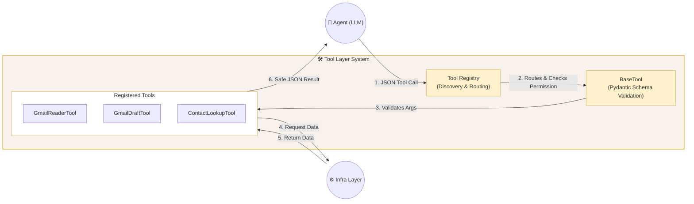
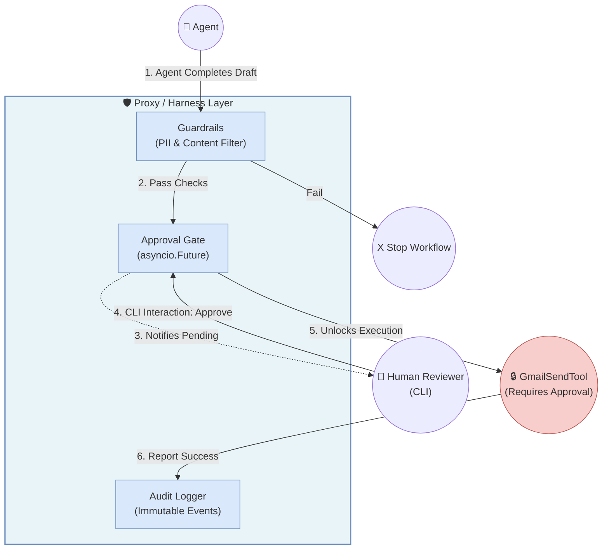
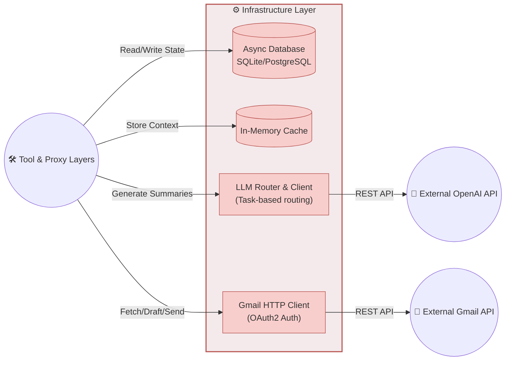

# Solution Design: Context Diagrams for Tools, Proxy, and Infrastructure

Below is the detailed design (Context Diagrams) illustrating how modules interact within the **AI Email Assistant Harness** architecture. These designs focus on three main layers: **Tools Layer**, **Proxy Layer** (acting as Security/Approval), and **Infrastructure Layer**.

---

## 1. Module 1: Tools Layer (Interface Adapter)
**Design Objective:** Encapsulate all external API calls. The Agent never calls APIs directly but must route through the Tool Layer. The Tool Layer is responsible for standardizing input (schema validation) and parsing output results.

---

## 2. Module 2: Proxy Layer (Harness & Security Boundary)
**Design Objective:** The Proxy is not a network proxy, but a **Security Proxy (Harness Orchestrator)**. It sits between the Agent and dangerous actions (like sending an email). Its function is to block the Agent from autonomously sending emails, run Guardrails, and wait for a Human-in-the-loop to approve.

---

## 3. Module 3: Infrastructure Layer
**Design Objective:** The lowest level, containing no AI business logic. It handles all I/O, Database connections, Caching, and external API calls (OpenAI, Gmail). The Tools Layer and Proxy Layer depend entirely on the Infra Layer.

